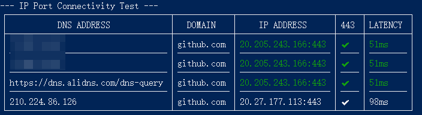

> Fork from [palemoky/dnspick](https://github.com/palemoky/dnspick)。

公司设备及内网，不允许科学上网。问 chat 了解到，GFW 也可能有对某些 ip 地址的“抖动限流”。所以我想换 DNS 来切换可用的 ip 地址。

## 安装

**Windows (PowerShell)**

```powershell
irm https://raw.githubusercontent.com/lvjiaxuan/dnspick/main/install.ps1 | iex
```

更多安装方式（Linux / macOS / 手动下载等）[参考](https://github.com/palemoky/dnspick#installation)。

## New Feature: `--port`

DNS 解析 + 多端口 TCP 连通性测试（支持逗号分隔指定多个端口）。

### 使用方法

在原 `dnspick` 输出内容下方，追加端口连通性测试表格：

```sh
# 单端口（443）
dnspick --port 443 -d "github.com"

# 多端口（443 + 22）
dnspick --port 443,22 -d "github.com"
```

仅输出 DNS 解析 + 端口连通性测试表格（跳过综合测试结果和推荐）：

```sh
dnspick --port-only 443 -d "github.com"
```

### 截图


